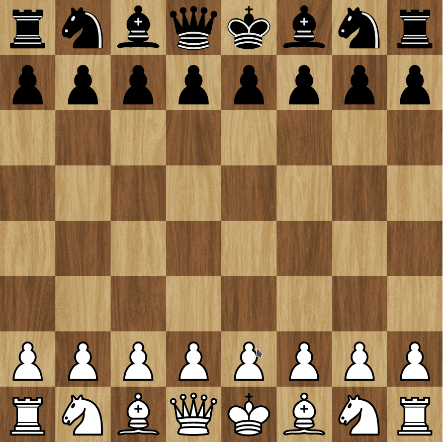

<h1 align="center">Simple chess</h1>

👉 [View Live](https://simplechess.netlify.app/)



[](https://opensource.org/licenses/MIT)
[](http://makeapullrequest.com)

## Built using
- Typescript
- HTML & SASS
- Gulp

## To-do ✨

- [X] Movements
  - [X] Pawn
  - [X] Bishop
  - [X] Knight
  - [X] Rook
  - [X] Queen
  - [X] King
- [ ] Special events
  - [X] Check validation
  - [X] Checkmate
  - [X] Stalemate
  - [X] Castling
  - [X] En passant
  - [ ] Pawn promotion
  - [ ] Draw cases (Only stalemate was implemented)
- [ ] Misc
  - [ ] Change the square style of available movements when clicking a piece
  - [ ] Nice style
  - [ ] Add clock time for both players
  - [ ] Shows which player moves next
  - [ ] allow undo movements
  - [ ] Sound effects when make moves
  - [ ] Create a logo (svg)
  - [ ] Prettier & eslint config
  
## Development setup 🛠

- [Node.js and npm](https://nodejs.org) installed (LTS)
```sh
cd directory-name

# Install dependencies
npm install

# You'll need gulp-cli installed
npm i gulp-cli -g

# Start gulp and create dist folder if it doesn't exist
gulp watch
```

## License

Licensed under the MIT license.

---

👉 [View Live](https://simplechess.netlify.app/)
